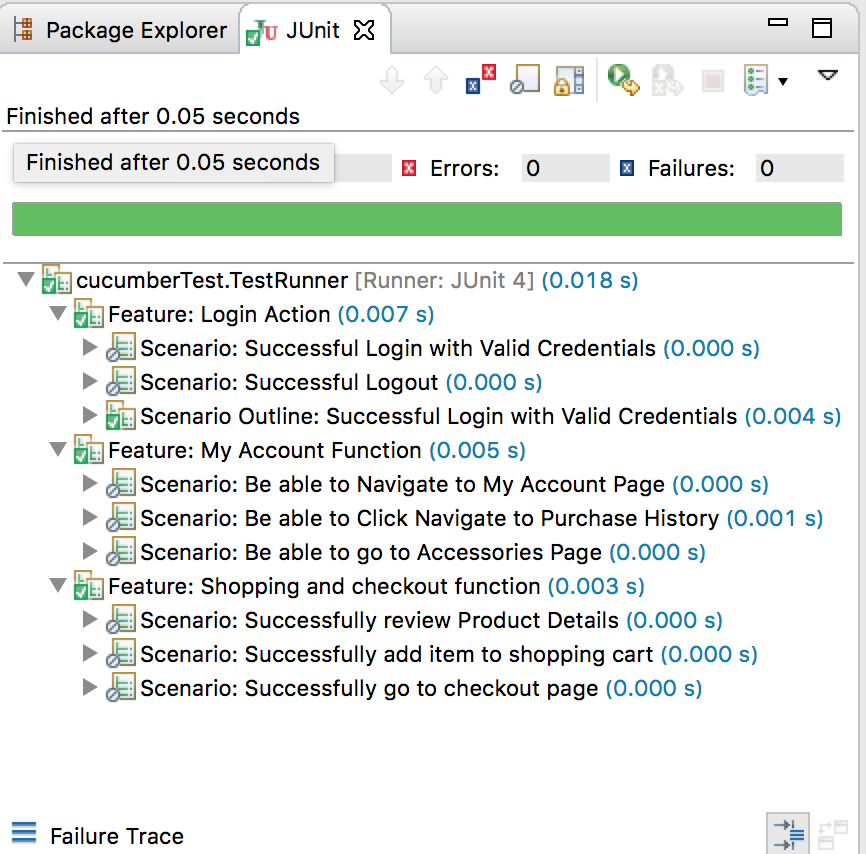

# Online Shopping Website Testing 

> Online shopping website Testing use JUnit, Cucumber and Java

## Project Dependencies

1. BDD Test: cucumber 
2. Feature File: Gherkin
3. Test Driver: JUnit
4. Browser Driver: Google Chrome
5. IDE: Eclipse

## Project Structure
  
  
  Link to [Test Runner](./OnlineStore/src/cucumberTest/TestRunner.java)
  
  Link to [Test Definition](./OnlineStore/src/testDefinition/Test_Steps.java)

## Test Result Screeshot

  

## Issues Description and Special Steps

The First Special Steps needed for this project is download chromedriver, since I am using chrome for testing, I have to tell the System to use chrome driver. Another special steps needed is to inspect elements on a web page, some of buttons and links have `id`s and `class` while other elements needs to specify `innerText` and perform continue click in order to have a expected behaviors. 

An issue I encountered is that I found I have to order my test in a reasonable order so that it will mimic a user's behavior and also will make the test easier to code. For example, I cannot test if user can checkout before the user has logged In. 

## Feature and Scenario Description 

In the project I use GherKin for writing feature file, they are available at: [Feature File](./OnlineStore/Feature/)

