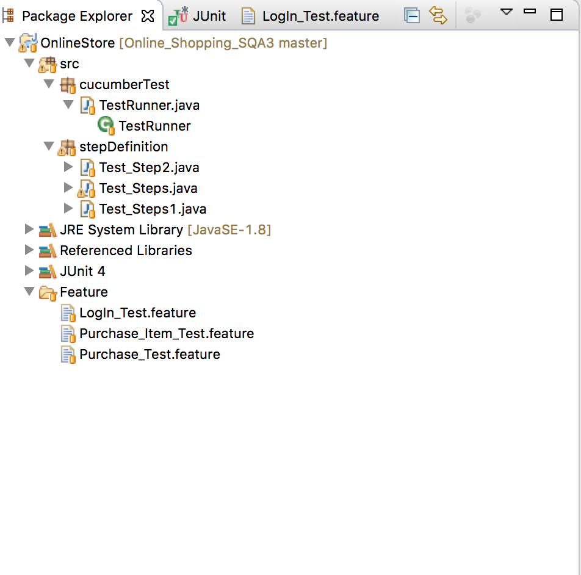

# Online Shopping Website Testing 

> Online shopping website Testing use JUnit, Cucumber, Selenium and Java

## Project Dependencies

1. BDD Test: cucumber 
2. Feature File: Gherkin
3. Test Driver: JUnit
4. Browser Driver: Google Chrome
5. IDE: Eclipse
6. Website Tested: [store.demoqa.com](http://store.demoqa.com)

## Some Tips for Running the Project 

1. All jar files and webdriver file is contained in `jars` folder, please make sure all those jars are configured before running the test  
2. Please modify the webdriver path in all java classes in stepDefinition folder, so that it will match your local path
3. The TestRunner is in `cucumberTest` folder

## Project Structure

  
  
  Link to [Test Runner](./OnlineStore/src/cucumberTest/TestRunner.java)
  
  Link to [Step Definition](./OnlineStore/src/stepDefinition): in this folder, there are three classes, `Test_Steps.java` is for feature file `Login_Test.feature`, `Test_Steps1.java` is for `Purchase_Item_Test.feature`, `Test_Steps2.java` is for `Purchase_Test.feature`. 

## Test Result Screeshot

  

## User Stories

1. Story 1: I want to login to my account so that I can navigate and then Logout
2. Story 2: I want to login to my account and go to items page so that I can see item details 
3. Story 3: I want to add an item from the website and add it to my shopping cart so that I can checkout and finishing buying the item 

## Issues Description and Special Steps

The First Special Steps needed for this project is download chromedriver, since I am using chrome for testing, I have to tell the System to use chrome driver. Another special steps needed is to inspect elements on a web page, some of buttons and links have `id`s and `class` while other elements needs to specify `innerText` and perform continue click in order to have a expected behaviors. 

An issue I encountered is that I found I have to order my test in a reasonable order so that it will mimic a user's behavior and also will make the test easier to code. For example, I cannot test if user can checkout before the user has logged In. 

## Feature and Scenario Description 

In the project I use GherKin for writing feature file, they are available at: [Feature File](./OnlineStore/Feature/)

## References

1. [First Cucumber Selenium Java Test](http://toolsqa.com/cucumber/first-cucumber-selenium-java-test/)
2. [Data Tables in Cucumber](http://toolsqa.wpengine.com/cucumber/data-tables-in-cucumber/)
3. [Feature File](http://toolsqa.wpengine.com/cucumber/cucumber-jvm-feature-file/)

